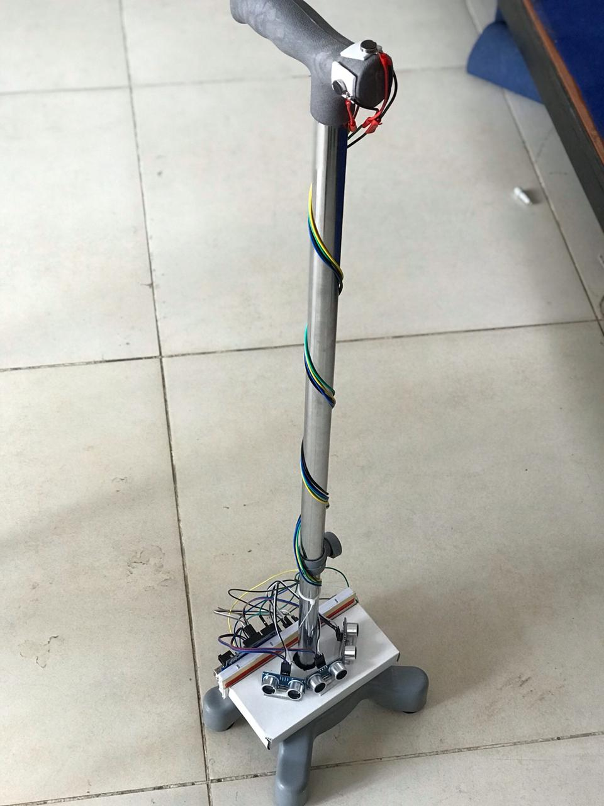
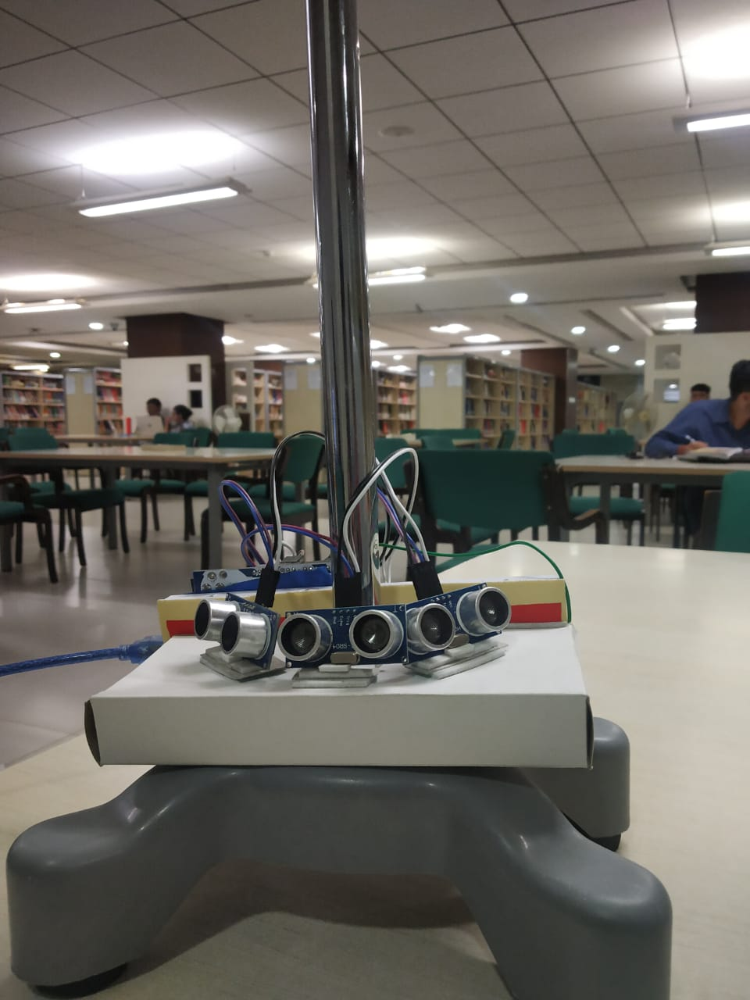
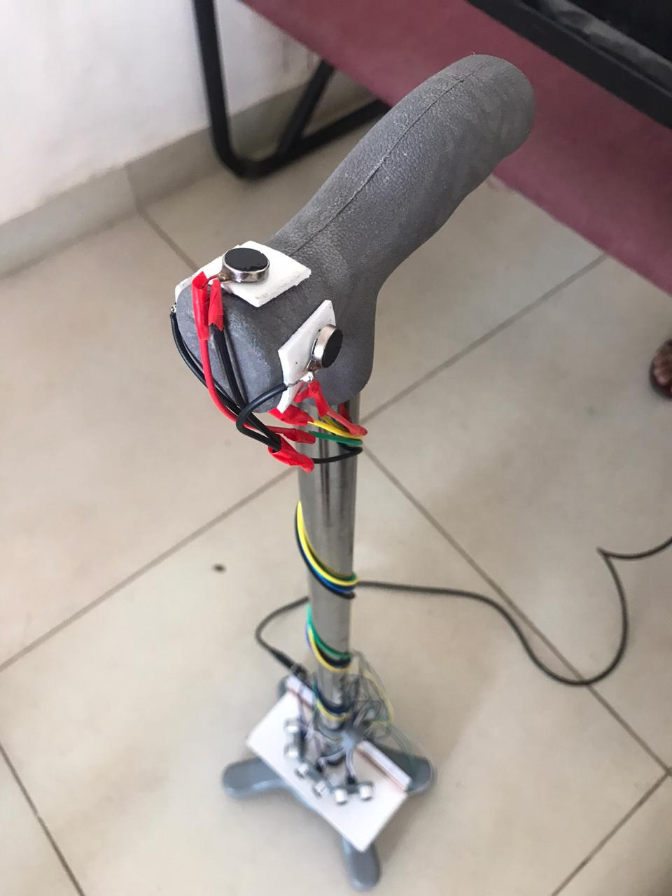
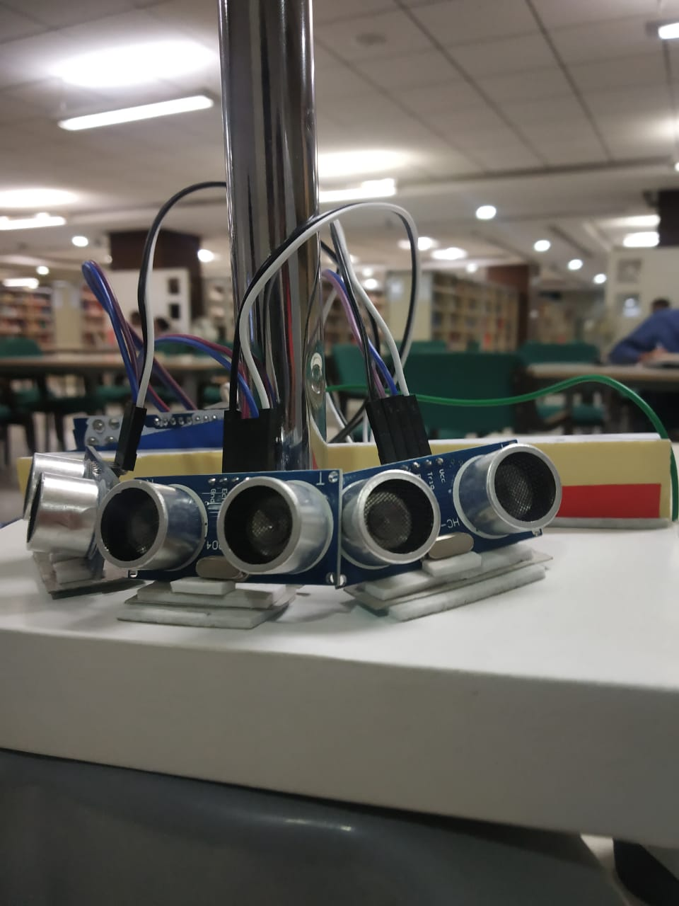
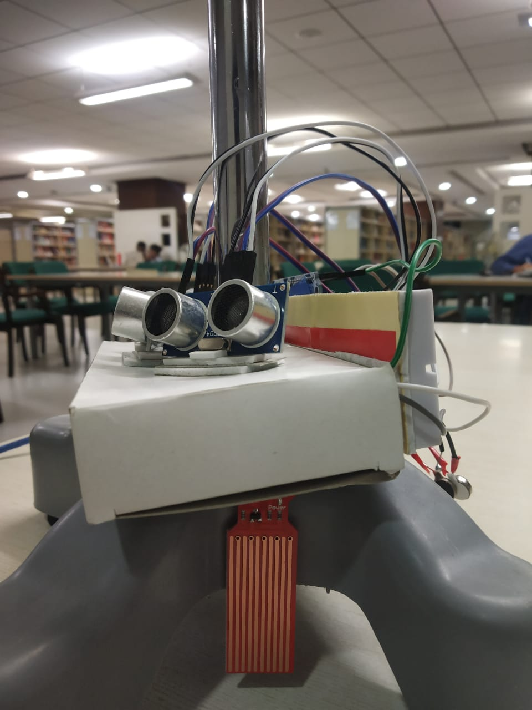

# arduino-smartwalkingcane
## An Arduino based Smart Walking Cane project 

This project was completed for college credits for an Embedded Systems Course.

The project's goal was to create a low cost and light weight system with an Arduino microcontroller and ultrasonic sensors that can alert a visually impaired person to an obstacle with directional haptics. There is also a water level sensor embedded that detects water puddles and alerts the user by activating all the haptics.

The haptics are located are strategic points on the handle of the walking cane to provide a sense of directionality to the user when the haptic alerts are active.

